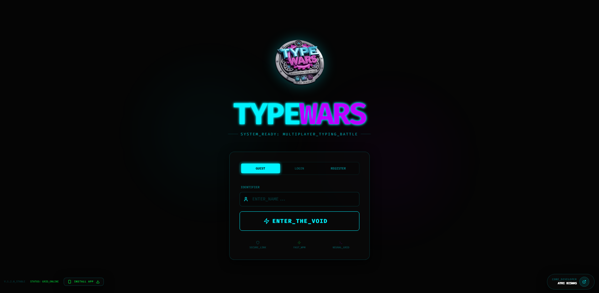
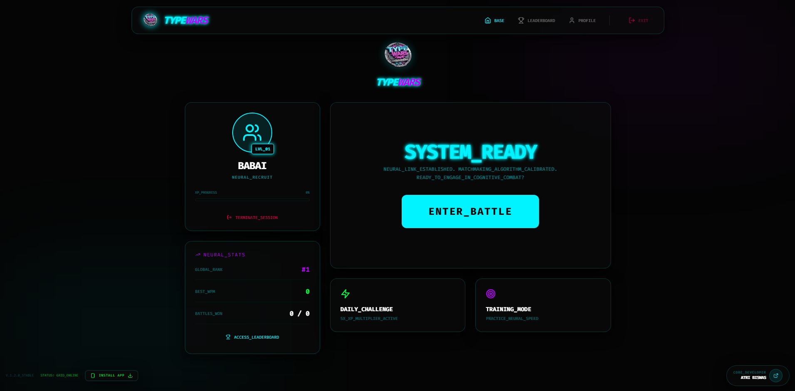
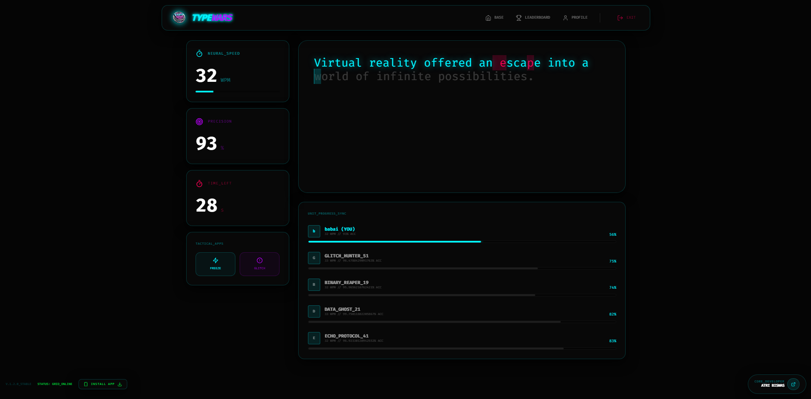
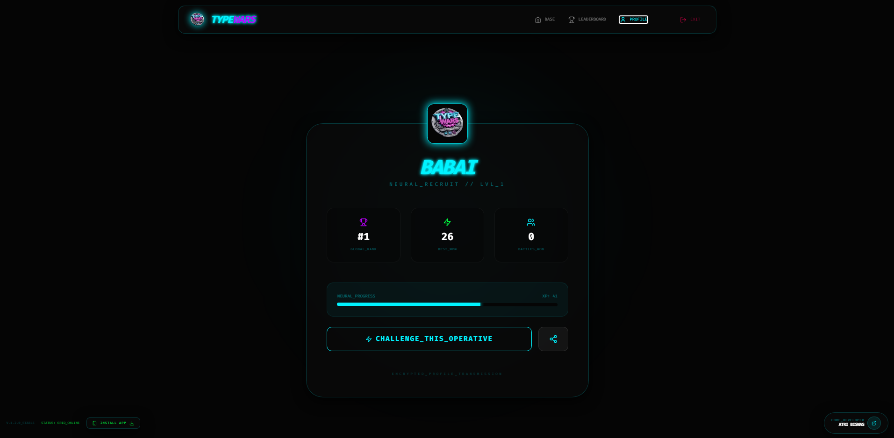
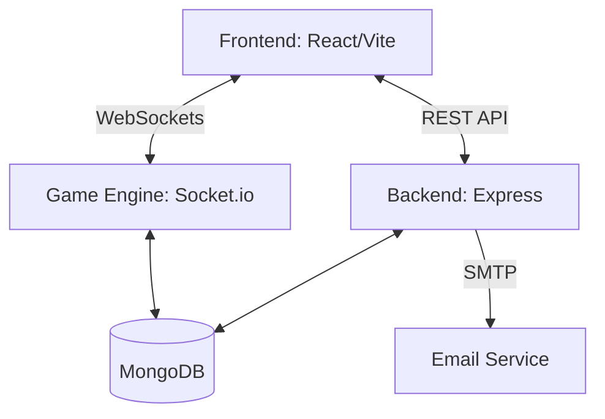

# ⚡ TypeWars: Neural Grid Typing Battle

[](https://opensource.org/licenses/MIT)


**TypeWars** is a high-octane, cyberpunk-themed real-time typing battle platform. Compete against players worldwide in the "Neural Grid", track your WPM performance, climb the global leaderboards, and level up your typing skills.

---

## 🖼️ Project Showcase

> [!NOTE]
> GitHub READMEs are static and do not support interactive JavaScript sliders. Below is a structured gallery of the platform. For an animated experience, we recommend combining these into a GIF.

<div align="center">
  
  <br />
  <p><i>The Neural Grid Landing Interface</i></p>
</div>

<hr />

<div align="center">
  <table border="0">
    <tr>
      <td width="33%" align="center">
        
        <br /><b>Matchmaking Lobby</b>
      </td>
      <td width="33%" align="center">
        
        <br /><b>Real-time Combat</b>
      </td>
      <td width="33%" align="center">
        
        <br /><b>Neural Stats</b>
      </td>
    </tr>
  </table>
</div>

---

## 🚀 Key Features

- 🎮 **Real-time Multiplayer Battles**: Join lobbies and race against other players in live typing matches.
- 👤 **Dual Authentication**: Sign in as a Guest for quick play or create a Secure Account with OTP verification to track progress.
- 🏆 **XP & Progression System**: Earn XP for every race, level up your profile, and unlock achievements.
- 📊 **Dynamic Leaderboards**: Compete for the top spot in global rankings based on WPM and wins.
- 📅 **Daily Challenges**: Complete specialized typing tasks to earn bonus rewards.
- 🛡️ **Secure Encryption**: All communications are encrypted, with OTP-based recovery and verification.
- 🐳 **Docker Support**: Easy deployment using Docker and Docker Compose.

---

## 🛠️ Tech Stack

### Frontend
- **Framework**: React.js with Vite
- **Styling**: Tailwind CSS (Cyberpunk Theme)
- **Animations**: Framer Motion
- **Icons**: Lucide React
- **State Management**: React Hooks & Context API

### Backend
- **Runtime**: Node.js
- **Framework**: Express.js
- **Real-time**: Socket.io
- **Database**: MongoDB (Mongoose ODM)
- **Security**: JWT, Bcrypt.js
- **Email**: Nodemailer (SMTP/Brevo)

---

## 🏗️ Architecture

TypeWars follows a **Client-Server-Event** architecture:

1.  **Client (React)**: Handles the UI/UX, local typing logic (WPM calculation, error detection), and communicates with the server via REST and WebSockets.
2.  **Server (Express)**: Manages authentication, user profiles, and serves as the REST API layer.
3.  **Real-time Engine (Socket.io)**: Handles the matchmaking queue, game state synchronization, and live race updates.
4.  **Database (MongoDB)**: Persists user data, race history, and global rankings.



---

## 📂 Project Structure

```text
typewars-open/
├── backend/                # Node.js Express Server
│   ├── controllers/        # Route logic
│   ├── models/             # Mongoose schemas
│   ├── routes/             # API endpoints
│   ├── sockets/            # Socket.io game logic
│   ├── utils/              # Helper functions (Email, etc.)
│   └── server.js           # Entry point
├── frontend/               # React Vite Application
│   ├── src/
│   │   ├── components/     # Reusable UI elements
│   │   ├── pages/          # View components
│   │   ├── services/       # API & Socket services
│   │   └── assets/         # Static files
├── docs/                   # Documentation & Images
└── docker-compose.yml      # Orchestration
```

---

## ⚙️ Setup Guide

### Prerequisites
- [Node.js](https://nodejs.org/) (v16+)
- [MongoDB](https://www.mongodb.com/) (Local or Atlas)
- [Docker](https://www.docker.com/) (Optional)

### Installation

1.  **Clone the repository**:
    ```bash
    git clone https://github.com/yourusername/typewars-open.git
    cd typewars-open
    ```

2.  **Backend Setup**:
    ```bash
    cd backend
    npm install
    cp .env.example .env
    ```
    *Edit `.env` and provide your MongoDB URI and SMTP credentials.*

3.  **Frontend Setup**:
    ```bash
    cd ../frontend
    npm install
    cp .env.example .env
    ```

### Running Locally

1.  **Start Backend**:
    ```bash
    cd backend
    npm run dev
    ```

2.  **Start Frontend**:
    ```bash
    cd frontend
    npm run dev
    ```

3.  Access the app at `http://localhost:5173`.

---

## 🤝 Contribution Guide

We welcome contributions! To contribute, please check [CONTRIBUTING.md](./CONTRIBUTING.md).

---

## 📄 License

Distributed under the MIT License. See `LICENSE` for more information.

---

<p align="center">
  Developed by <a href="https://github.com/atribiswas03">Atri Biswas</a>
</p>
